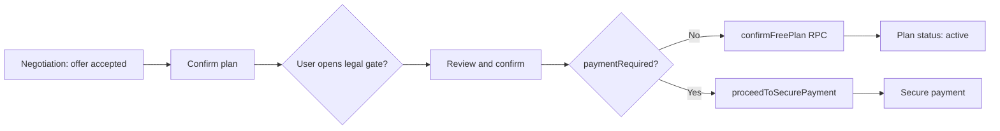

# Payment flow content matrix — LinkUp Web & Mobile

> **Purpose:** Document how Agreement, Review & Confirm, and Secure Payment screens should behave across plan types, escrow patterns, and platforms — and what is implemented today vs what is needed for scalability.
>
> **Audience:** Product, engineering (web + mobile), QA.
>
> **Last updated:** July 2026 (linkup-web audit).

---

## 1. Executive summary

LinkUp paid meetups move through three user-facing steps after negotiation:

| Step | User-facing name | Primary goal |
|------|------------------|--------------|
| 1 | **Review & confirm** | Legal summary + checkbox; no money moves |
| 2 | **Confirm plan** (Agreement) | Meetup summary, party confirmation, payment preview |
| 3 | **Secure payment** | Flutterwave checkout via escrow row |

**Free plans** skip step 3 entirely. Both parties confirm terms; the plan goes `active` without escrow.

**Paid plans** must show copy that depends on a **content matrix**, not a single “Pattern B” template:

```
planKind × escrowPattern × viewerRole × phase (pre/post funding, group close, etc.)
```

Today, **payment mechanics** (who pays, how much, waiting states) are largely pattern-aware via shared backend logic. **Informational copy** is only complete for a subset of combinations (notably group split and standard/mood 1:1 split). Copy is scattered across web components with `if/else` branches — this does not scale.

**Recommendation:** Extract a **shared content resolver** (TypeScript module consumed by web and mobile) keyed on the matrix below. UI shells (`EscrowNoticeBanner`, cards) stay platform-specific; strings and visibility flags come from one source.

---

## 2. Platforms & shared backend

| Layer | LinkUp Web | LinkUp Mobile |
|-------|------------|---------------|
| Repo | `linkup-web/` (Next.js) | Separate Expo app (not in this repo) |
| Backend | Same Supabase project, RLS, RPCs | Same |
| Types | `src/types/database.ts` (synced from mobile) | Source of truth for DB types |
| Checkout | Flutterwave via `create-escrow-payment` edge function | Same edge function |
| Escrow creation | `create_plan_escrow_transaction` RPC | Same RPC |
| Group close | `close_group_and_create_host_escrow` RPC | Same RPC |
| Free confirm | `confirmFreePlan` → `plans.status = 'active'` | Equivalent flow expected |

Web explicitly targets **parity** with mobile for escrow checkout, publish RPCs, and server-enforced cancellation outcomes. Any content resolver should live in a **shared package** or duplicated from a single spec both teams import.

---

## 3. Screen map (three steps)

### 3.1 Review & confirm

| | Web | Mobile (expected) |
|---|-----|-------------------|
| **Route / screen** | Inline mode inside `PlanAgreementScreen` when `legalOpen === true` | Equivalent pre-payment legal step |
| **Component** | `PreAgreementReviewContent` | Platform UI; same sections |
| **Title** | “Review & confirm” | Same intent |
| **Triggers** | User taps “Review terms & pay”, “Review & confirm plan”, or “Review & confirm terms” | Same |

**Sections shown:**

- Plan summary (when, location, agreed price)
- Escrow (held amount + “next screen” preview **or** free-plan message)
- Fees estimate **or** “No platform fee on free plans”
- Cancellation policy table
- Checkbox: “I have read this summary and agree…”

**Free vs paid:**

| | Paid | Free |
|---|------|------|
| Escrow section | Held amount, user pay amount, Flutterwave note | “No escrow for this free plan.” |
| Fees section | Platform fee estimate | “No platform fee on free plans.” |
| After confirm | Routes to Confirm plan payment flow or creates escrow | `confirmFreePlan()` → plan `active` |

**Gap:** `PreAgreementReviewContent` does **not** vary copy by plan kind (group/mood/standard) or escrow pattern (A/B/C). It only distinguishes paid vs free via `escrowAmountCents > 0`.

---

### 3.2 Confirm plan (Agreement)

| | Web | Mobile (expected) |
|---|-----|-------------------|
| **Route** | `/plan/[id]/agreement?offerId=…` | Deep link / stack screen with `planId` + `offerId` |
| **Screen** | `PlanAgreementScreen` | Agreement / Confirm plan screen |
| **Metadata title** | “Confirm plan” | Same |

**Core logic flags** (`PlanAgreementScreen`):

| Flag | Derivation |
|------|------------|
| `paymentRequired` | `(agreed_price_cents ?? offer.amount_cents ?? starting_price_cents) > 0` |
| `showPaymentFlow` | `paymentRequired && !userLegFunded && !isPlanConfirmed` |
| `needsConfirm` | `status === 'agreed'` or group slot accepted + free + `negotiating` |
| `awaitingPay` | `status === 'awaiting_payment'` or group accepted + paid |
| `isGroupSplit` | `is_group_plan && escrow_pattern === 'B'` |

**Components rendered (paid plans):**

| Condition | Component | Plan coverage |
|-----------|-----------|---------------|
| `isGroupSplit && showPaymentFlow` | `GroupSplitAgreementSection` | Group + split only |
| `is_group_plan && !isGroupSplit` | `GroupEscrowStatusCard` | Group + host fund (A) or guest fund (C) |
| `!isGroupSplit && is_paid && showPaymentFlow` | `PlanEscrowPaymentCard` | Standard/mood 1:1 (all patterns) |
| `!isGroupSplit && showPaymentFlow` | `AgreementPaymentPreviewCard` | Standard/mood paid preview |
| High value | `HighValueEscrowNoticeCard` | All paid above tier-1 cap |
| Funded / confirmed | `AgreementEscrowStateCard` | Post-payment waiting states |

**Free plans on Confirm plan:**

- No payment cards (`showPaymentFlow === false`)
- Subtitle: “Review the meetup summary and confirm when you are ready.”
- Primary CTA: “Review & confirm plan” → legal gate → `confirmFreePlan`
- Group free: `needsConfirm` while `status === 'negotiating'` with accepted slot

**Gaps:**

- Mood vs standard not distinguished in payment cards
- Pattern A/C lack dedicated explanatory copy on this screen
- `AgreementPaymentPreviewCard` hidden for group split (correct) but group A/C only get progress UI, not pattern-specific education

---

### 3.3 Secure payment

| | Web | Mobile (expected) |
|---|-----|-------------------|
| **Route** | `/escrow/[id]?planId=…&offerId=…` | Escrow / secure payment screen with `escrowId` |
| **Screen** | `EscrowDetailScreen` | Same flow; Flutterwave return handling |
| **Metadata title** | “Secure payment” | Same |
| **Back link** | `resolveEscrowBackHref` → Agreement | Same context params |

**Not used for free plans** — no escrow row is created (`proceedToSecurePayment` rejects `!is_paid`).

**UI shell for pattern info card:** `EscrowNoticeBanner` (purple left stripe, shield icon, title + body).

**Mechanics helper:** `getEscrowFundingUiState` — pattern A/B/C aware (who can fund, amounts, waiting).

**Host share modal (Pattern B, 1:1 only):** `HostSharePaymentModal` — standard/mood split host; excluded for group split.

---

## 4. Taxonomy (dimensions)

### 4.1 Plan kind

| Kind | DB signals | Notes |
|------|------------|-------|
| **Standard** | `!is_group_plan && !is_mood_plan` | Default 1:1 meetup |
| **Mood** | `is_mood_plan === true` | Shorter funding window (1h vs 24h deadline) |
| **Group** | `is_group_plan === true` | Multiple guest slots; per-slot escrows |

Standard and mood are **orthogonal** to group — a plan is one of: standard, mood, or group (not mood+group in typical publish flow).

### 4.2 Escrow pattern (funding type)

| Pattern | Name | Who pays (1:1) | Group behavior |
|---------|------|----------------|----------------|
| **A** | Host funds | Host pays full amount | Host funds; guests may have separate slot escrows depending on setup |
| **B** | Split | Host + guest shares (`host_contribution_bps`) | **Group split:** per-guest negotiated amounts + host share after group close |
| **C** | Guest funds | Guest pays full amount | Guest-funded slots; host waits |

DB: `plans.escrow_pattern` → `'A' | 'B' | 'C'`.

Group dynamic split: `is_group_plan && escrow_pattern === 'B'` (`isGroupSplitPlan()`).

### 4.3 Viewer role

| Role | Derivation |
|------|------------|
| Host | `userId === plan.creator_id` or `escrow.host_id` |
| Guest | `userId === offer.bidder_id` or `escrow.guest_id` |
| Group host (split) | Host before `host_escrow_id` / `group_closed_at` — special **close group first** phase |

### 4.4 Paid vs free

| | Paid | Free |
|---|------|------|
| `plan.is_paid` | `true` | `false` |
| `paymentRequired` | amount > 0 | amount === 0 |
| Escrow row | Created via RPC | Never |
| Secure payment screen | Yes | **Never shown** |
| Confirm path | Terms → escrow → Flutterwave | Terms → `confirmFreePlan` → active |

**Note:** `paymentRequired` is amount-based. A plan with `is_paid: false` and zero price is free. Edge case: `is_paid: true` with zero agreed amount should not occur in normal flow.

---

## 5. Full content matrix (paid plans)

Legend: **✓** = tailored copy today (web) · **~** = partial / generic · **✗** = missing or wrong · **n/a** = screen not shown

### 5.1 Review & confirm

| Plan | Pattern | Copy tailored? | Notes |
|------|---------|----------------|-------|
| Any | Any (paid) | ~ | Generic escrow + fee text; no pattern/role variants |
| Any | Free | ✓ | “No escrow” / “No platform fee” |

### 5.2 Confirm plan (Agreement)

| # | Plan | Pattern | Web component | Copy quality |
|---|------|---------|---------------|--------------|
| 1 | Group | A (host fund) | `GroupEscrowStatusCard` | ~ Progress only; not “host funds plan” |
| 2 | Group | C (guest fund) | `GroupEscrowStatusCard` | ~ Same card; not guest-fund specific |
| 3 | Group | B (split) | `GroupSplitAgreementSection` | ✓ Dedicated host/guest copy |
| 4 | Mood | B | `PlanEscrowPaymentCard` + preview | ~ Same as standard split |
| 5 | Mood | A | `PlanEscrowPaymentCard` | ~ Generic “Escrow setup” |
| 6 | Mood | C | `PlanEscrowPaymentCard` | ~ Generic |
| 7 | Standard | B | `PlanEscrowPaymentCard` + preview | ✓ Split preview + leg cards |
| 8 | Standard | A | `PlanEscrowPaymentCard` | ~ Generic |
| 9 | Standard | C | `PlanEscrowPaymentCard` | ~ Generic |

### 5.3 Secure payment

| # | Plan | Pattern | Info card title (web) | Copy quality |
|---|------|---------|----------------------|--------------|
| 1 | Group | A | “Group escrow” | ~ Generic group message |
| 2 | Group | C | “Group escrow” | ~ Same; not guest-fund specific |
| 3 | Group | B | “Group plan escrow” | ✓ Role-specific (recent) |
| 4 | Mood | B | “Pattern B escrow” + mood banner | ✓ Split + deadline |
| 5 | Mood | A | “Pattern A escrow” | ~ Generic fallback body |
| 6 | Mood | C | “Pattern C escrow” | ~ Generic fallback body |
| 7 | Standard | B | “Pattern B escrow” | ✓ 1:1 split copy + leg cards |
| 8 | Standard | A | “Pattern A escrow” | ~ Generic fallback body |
| 9 | Standard | C | “Pattern C escrow” | ~ Generic fallback body |

**Generic fallback (A/C today):**  
“Funds are held until the meetup is confirmed. Activation happens automatically after Flutterwave confirms payment.”

This does not explain host-fund vs guest-fund responsibilities.

---

## 6. Free plans (all kinds)

Free plans use the **same three-screen shell** but **skip escrow and secure payment**.

### 6.1 Flow



### 6.2 By plan kind (free)

| Plan kind | Agreement behavior | Secure payment |
|-----------|-------------------|----------------|
| Standard 1:1 | Both confirm → `active` | Not shown |
| Mood 1:1 | Same; mood expiry rules apply elsewhere | Not shown |
| Group | Slot accepted + `needsConfirm` while negotiating; host/guest confirm | Not shown |

### 6.3 Web implementation touchpoints

| File | Free-plan behavior |
|------|-------------------|
| `PlanAgreementScreen` | `paymentRequired` false → no payment cards, free CTAs |
| `PreAgreementReviewContent` | Escrow/fees sections show free copy |
| `planAgreementActions.confirmFreePlan` | Sets `active` from `agreed` |
| `planAgreementActions.proceedToSecurePayment` | Returns error if `!is_paid` |
| `EscrowDetailScreen` | Never reached |

### 6.4 Scalability note for free plans

Free plans should **not** import paid-plan content resolver branches. Use a single `planTier: 'free' | 'paid'` gate at the top of the resolver:

```typescript
if (planTier === 'free') {
  return FREE_PLAN_COPY[screen][planKind]; // minimal: standard | mood | group
}
```

---

## 7. Current web architecture (why it doesn’t scale)

```
PlanAgreementScreen
├── legalOpen ? PreAgreementReviewContent          ← paid/free only
└── main
    ├── isGroupSplit ? GroupSplitAgreementSection  ← one special case
    ├── is_group_plan ? GroupEscrowStatusCard      ← another special case
    └── !isGroupSplit ? PlanEscrowPaymentCard      ← standard/mood bucket

EscrowDetailScreen
├── inline if/else → escrowPatternNoticeTitle/Body
├── isStandardSplitEscrow → FundLegCard grid
├── isMoodPlan → extra banner
└── isGroupHostBeforeClose → guard UI
```

**Problems:**

1. **Combinatorial explosion** — Each new plan type adds more `if (isGroupSplit)` patches.
2. **Duplication** — Similar strings in `HostSharePaymentModal`, `GroupSplitAgreementSection`, `EscrowDetailScreen`.
3. **Mobile drift** — Without a shared module, web and mobile copy diverge.
4. **Review step ignored** — Richest legal moment has the least plan-aware copy.

---

## 8. Target architecture (scalable)

### 8.1 Shared content resolver

Proposed module (web: `src/lib/escrow/escrowScreenContent.ts`; later extract to `@linkup/escrow-content` for mobile):

```typescript
export type PlanKind = 'standard' | 'mood' | 'group';
export type EscrowPattern = 'A' | 'B' | 'C';
export type ViewerRole = 'host' | 'guest';
export type PaymentScreen = 'review' | 'agreement' | 'secure_payment';
export type PlanTier = 'free' | 'paid';

export type EscrowScreenPhase =
  | 'default'
  | 'group_host_before_close'
  | 'waiting_counterparty'
  | 'user_funded'
  | 'fully_funded';

export interface EscrowScreenContentInput {
  screen: PaymentScreen;
  planTier: PlanTier;
  planKind: PlanKind;
  pattern: EscrowPattern | null;
  role: ViewerRole;
  phase?: EscrowScreenPhase;
  isGroupSplit?: boolean; // group + B
}

export interface EscrowScreenContent {
  patternCardTitle: string | null;
  patternCardBody: string | null;
  headerSubtitle: string | null;
  showPatternLegCards: boolean;
  showMoodDeadlineBanner: boolean;
  showGroupBadge: boolean;
  fundCtaLabel: string | null;
  // …visibility flags only; amounts from existing preview helpers
}

export function resolveEscrowScreenContent(input: EscrowScreenContentInput): EscrowScreenContent;
```

### 8.2 Separation of concerns

| Concern | Module | Platforms |
|---------|--------|-----------|
| **Copy & visibility** | `resolveEscrowScreenContent` | Web + mobile |
| **Amounts & payer** | `getAgreementPaymentPreview`, `getEscrowFundingUiState`, `resolveEscrowParties` | Web + mobile |
| **Visual shell** | `EscrowNoticeBanner`, cards, native equivalents | Per platform |
| **Money movement** | Supabase RPCs + edge functions | Server only |

### 8.3 UI components stay dumb (Case B)

`EscrowNoticeBanner` already accepts `title` + `children`. Do **not** embed plan logic inside it. Pass output from resolver:

```tsx
const content = resolveEscrowScreenContent({ ... });
<EscrowNoticeBanner title={content.patternCardTitle!} icon={...}>
  {content.patternCardBody}
</EscrowNoticeBanner>
```

### 8.4 Mobile parity checklist

When implementing or auditing mobile, verify each cell in §5 matches web intent:

- [ ] Free plan never opens secure payment
- [ ] Group split: no 1:1 “50/50” or “both shares” language
- [ ] Group split host before close: redirect to close group, not ₦0 payment
- [ ] Pattern A: host sees pay CTA; guest sees waiting copy
- [ ] Pattern C: guest sees pay CTA; host sees waiting copy
- [ ] Pattern B (1:1): both shares + ratio from `host_contribution_bps`
- [ ] Mood: funding deadline surfaced on agreement + secure payment
- [ ] High-value: Platinum + KYC gates before checkout
- [ ] Flutterwave via same edge function; return URL per platform

---

## 9. Recommended copy stubs (paid — secure payment pattern card)

Use as spec for resolver implementation. **Do not change standard/mood Pattern B 1:1 strings** when migrating.

| planKind | pattern | role | title | description (summary) |
|----------|---------|------|-------|------------------------|
| group | B | host | Group plan escrow | Fund host share; activates when all guest shares + host paid |
| group | B | guest | Group plan escrow | Fund negotiated share; activates when all parties funded |
| group | A | host | Group plan · Host funds | You fund your portion; guests fund their slots separately |
| group | A | guest | Group plan · Host funds | Host funds the plan; your slot may not require payment |
| group | C | guest | Group plan · Guest funds | You fund your slot; plan activates when required guests pay |
| group | C | host | Group plan · Guest funds | Guests fund their slots; you may not pay on this screen |
| mood | B | * | Pattern B escrow | *(existing 1:1 split copy)* + mood deadline banner |
| standard | B | * | Pattern B escrow | *(existing 1:1 split copy)* |
| mood/standard | A | host | Pattern A escrow | You pay the full escrow amount to activate the plan |
| mood/standard | A | guest | Pattern A escrow | Waiting for host payment before the plan goes active |
| mood/standard | C | guest | Pattern C escrow | You pay the full escrow amount to activate the plan |
| mood/standard | C | host | Pattern C escrow | Waiting for guest payment before the plan goes active |

---

## 10. QA matrix (smoke test)

### Paid

| Scenario | Review & confirm | Confirm plan | Secure payment |
|----------|------------------|--------------|----------------|
| Standard + B, host | Paid escrow summary | Split preview | Pattern B card + host share |
| Standard + B, guest | Paid escrow summary | Split preview | Pattern B card + guest share |
| Standard + A, host | Paid summary | Pay CTA | Pattern A host copy |
| Standard + C, guest | Paid summary | Pay CTA | Pattern C guest copy |
| Mood + B | + mood context in deadline | Split preview | Pattern B + mood banner |
| Group + B, guest | Paid summary | Group split section | Group plan escrow |
| Group + B, host pre-close | Paid summary | Close group first | Close group guard |
| Group + B, host post-close | Paid summary | Host share CTA | Group plan escrow + amount |
| Group + A/C | Paid summary | Group progress card | Group-specific pattern copy |

### Free

| Scenario | Review & confirm | Confirm plan | Secure payment |
|----------|------------------|--------------|----------------|
| Standard 1:1 | No escrow / no fee | Confirm plan → active | n/a |
| Mood 1:1 | Same | Same | n/a |
| Group slot | Same | Slot confirm → active | n/a |

---

## 11. Implementation roadmap

| Priority | Work | Impact |
|----------|------|--------|
| P0 | Add `resolveEscrowScreenContent` with paid matrix | Stops copy bugs; single source of truth |
| P0 | Wire `EscrowDetailScreen` to resolver | Fixes secure payment for all patterns |
| P1 | Wire `PlanAgreementScreen` cards to resolver | Confirm plan parity |
| P1 | Extend resolver for `review` screen | Review & confirm becomes plan-aware |
| P2 | Extract package for mobile import | Cross-platform scalability |
| P2 | Add unit tests per matrix cell | Regression safety |
| P3 | Document mobile screen names in mobile repo README linking here | Onboarding |

---

## 12. Key web files (reference)

| Screen | Route | Primary file |
|--------|-------|--------------|
| Review & confirm | (inline) | `src/components/plans/agreement/PreAgreementReviewContent.tsx` |
| Confirm plan | `/plan/[id]/agreement` | `src/features/plans/PlanAgreementScreen.tsx` |
| Secure payment | `/escrow/[id]` | `src/features/escrow/EscrowDetailScreen.tsx` |
| Pattern info card | — | `src/components/escrow/EscrowNoticeBanner.tsx` |
| Group split agreement | — | `src/components/plans/group/GroupSplitAgreementSection.tsx` |
| Group non-split progress | — | `src/components/escrow/GroupEscrowStatusCard.tsx` |
| 1:1 agreement payment | — | `src/components/escrow/PlanEscrowPaymentCard.tsx` |
| Payment preview | — | `src/components/plans/agreement/AgreementPaymentPreviewCard.tsx` |
| Funding mechanics | — | `src/lib/escrow/escrowFundingUi.ts`, `src/lib/escrow/escrowPaymentPreview.ts` |
| Group split detection | — | `src/lib/plans/groupDynamicSplit.ts` |
| Escrow routing | — | `src/lib/plans/planAgreementRoute.ts` |
| Free confirm / escrow create | — | `src/lib/plans/planAgreementActions.ts` |

---

## 13. Bottom line

**Your goal is correct:** Secure payment and Confirm plan should be fully dynamic across plan kind, escrow pattern, role, and free vs paid — not special-cased for group split alone.

**What happens today:**

- **Free plans** are handled coherently: no secure payment, clear free copy on review, `confirmFreePlan` on confirm.
- **Paid plans** have reliable **payment mechanics** across A/B/C but **incomplete informational copy** outside group split and standard/mood 1:1 split.
- **Web and mobile** share backend rules; **copy is not centralized**, so scalability and parity depend on disciplined duplication today.

**What to build:** A shared `resolveEscrowScreenContent` (and free-plan branch) consumed by Review & confirm, Confirm plan, and Secure payment on **both** platforms — with platform-specific UI shells and server-side money logic unchanged.
