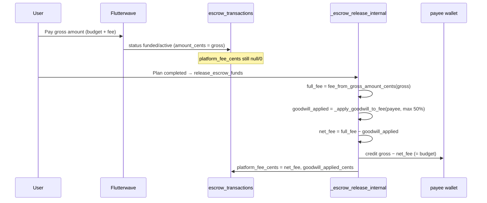

# Platform fee (app fee) — how it works

This document describes how LinkUp’s **platform fee** is calculated, when it is collected, and how it is shown to users on **linkup-web** and **LinkUp (mobile)**. Both clients share the same fee math; enforcement happens on the server at escrow **release**.

---

## 1. Summary

| Question | Answer |
|----------|--------|
| **What is it?** | A **flat 5%** fee on the plan **budget**, added on top at escrow creation (additive model). |
| **When is it charged?** | At **escrow release** after the plan is `completed`. The fee is embedded in the gross escrow amount; release deducts the fee portion from gross before crediting the payee. |
| **Who pays it?** | **Everyone on the plan proportionally.** Each payer funds their budget share plus their share of the 5% fee. The payee receives their full **budget** amount (gross minus fee). |
| **Free plans** | No escrow row → **no platform fee**. UI copy: “No platform fee on free plans.” |
| **Subscription tier** | Does **not** lower the fee percentage. |
| **Goodwill credits** | Can **reduce** the fee at release (FIFO), up to **50%** of the full fee. |

### Additive vs subtractive (historical)

| | Old (subtractive) | Current (additive) |
|---|-------------------|---------------------|
| Host sets budget | ₦30,000 | ₦30,000 |
| Escrow stores | ₦30,000 | ₦31,500 (budget + 5%) |
| Host receives at release | ₦28,500 | ₦30,000 |
| User sees at checkout | Budget (confusing) | Gross (honest) |

Historical escrow rows created before the restructure are **not** backfilled; they release correctly under the model they were created with.

---

## 2. Fee schedule (flat 5%)

Fee uses **500 basis points (bps)** on the plan **budget** (kobo), regardless of amount.

| Plan budget (NGN) | Platform fee (5%) | Gross escrow stored |
|-------------------|-------------------|---------------------|
| ₦10,000 | ₦500 | ₦10,500 |
| ₦60,000 | ₦3,000 | ₦63,000 |
| ₦600,000 | ₦30,000 | ₦630,000 |

**Formulas:**

```
fee_from_budget_cents = round(budget_cents × 500 / 10_000)
gross_cents           = budget_cents + fee_from_budget_cents

# At release (gross stored in escrow_transactions.amount_cents):
fee_from_gross_cents  = gross_cents − round(gross_cents / 1.05)
net_to_payee_cents    = gross_cents − net_fee_cents
                      = budget_cents   (when no rounding drift)
```

Where `net_fee_cents = max(0, full_fee_cents − goodwill_applied_cents)`.

### Source of truth (must stay in sync)

| Layer | Location |
|-------|----------|
| **Client (web + mobile)** | `lib/plans/planFinancialConfig.ts` |
| **Database** | `platform_fee_cents_for_amount`, `gross_amount_cents`, `fee_from_gross_amount_cents` in `supabase/migrations/20260620000019_flat_fee_restructure.sql` |

Web: `src/lib/plans/planFinancialConfig.ts`  
Mobile: `linkup/lib/plans/planFinancialConfig.ts` (identical logic)

**Key exports:**

| Function | Purpose |
|----------|---------|
| `platformFeeCentsForAmount(budgetCents)` | 5% of budget |
| `grossAmountCents(budgetCents)` | Budget + fee (what escrow stores) |
| `budgetFromGrossAmountCents(grossCents)` | Budget portion of a gross amount |
| `feeFromGrossAmountCents(grossCents)` | Fee portion of a gross amount |
| `goodwillMaxOffsetCents(feeCents)` | Max 50% of fee that goodwill can cover |

---

## 3. Escrow amounts: budget vs gross

| Field / concept | Stores budget or gross? |
|-----------------|-------------------------|
| `plans.starting_price_cents`, `agreed_price_cents` | **Budget** |
| `plan_offers.current_amount_cents` (negotiation) | **Budget** share |
| `plans.accepted_guest_amounts_sum_cents` | **Budget** sum of guest shares |
| `escrow_transactions.amount_cents` (new rows) | **Gross** (budget + fee) |
| `escrow_transactions.host_share_cents` / `guest_share_cents` | **Budget** shares (for split logic) |

At escrow creation, all INSERT paths call `gross_amount_cents(budget_share)` for `amount_cents`.

---

## 4. When the fee is applied (server flow)

The fee is **deducted at release**, not as a separate Flutterwave line item.



**Release RPC:** `release_escrow_funds` → `_escrow_release_internal`  
**Migration:** `20260620000019_flat_fee_restructure.sql` (replaces tiered logic from `20260610000003_escrow_server_tier_gates.sql`)

**Stored on escrow row after release:**

| Column | Meaning |
|--------|---------|
| `platform_fee_cents` | Fee actually charged (after goodwill) |
| `goodwill_applied_cents` | Portion of the full fee covered by goodwill credits |
| Payee wallet credit | `amount_cents − platform_fee_cents` (= budget) |

---

## 5. Goodwill credits and fee offset

Goodwill credits are issued in scenarios such as host cancel within 48h or no-show (see mobile `docs/REWARDS-AND-GOODWILL-CREDIT-USERFLOW.md`).

At release, `_apply_goodwill_to_fee`:

1. Caps offset at **50%** of the full platform fee (`FLOOR(fee × 50 / 100)`)
2. Loads the payee’s non-expired `goodwill_credits` (FIFO by `expires_at`)
3. Applies credit up to the cap
4. Writes `goodwill_applied_cents` on the escrow row
5. Credits payee wallet with **gross − net fee**
6. Inserts a **display-only** wallet ledger row (`is_display_only = true`, source `goodwill`)

---

## 6. What users see at checkout

Users pay the **gross** amount via Flutterwave. The escrow payment screen shows a breakdown:

- Plan contribution (budget share)
- Platform fee (5%)
- Total you pay (= `escrow.amount_cents`)

There is no hidden deduction at checkout; the fee is included in the total shown before payment.

---

## 7. How it is shown to users — linkup-web

### 7.1 Plan creation

**Component:** `src/components/plans/PlanBudgetFeeNotifier.tsx`  
Wired in `CreatePlanScreen` below the starting price input.

Shows: plan budget, +5% fee, total, per-person breakdown (group plans), and “You receive your full budget after the meetup is confirmed.”

### 7.2 Discover feed

**Components:** `DiscoverPlanListCard`, `DiscoverPlanCard`

Paid plans and group per-person shares show **gross** amounts with **“Incl. 5% platform fee”**.

### 7.3 Review & confirm (pre-payment estimate)

**Component:** `src/components/plans/agreement/PreAgreementReviewContent.tsx`

**Section: “Fees (estimate)”**

| Paid plan | Free plan |
|-----------|-----------|
| Plan budget | “No platform fee on free plans.” |
| Platform fee (5%, shared by all) — shown as **+ ₦X** | — |
| Total escrow (what you pay) | — |
| Host receives after meetup — **budget** amount | — |
| Footnote explaining shared additive fee | — |

“After you confirm” Flutterwave preview shows the user’s **gross** pay amount.

### 7.4 Secure payment / escrow detail

**Screen:** `src/features/escrow/EscrowDetailScreen.tsx`

| Phase | Fee-related UI |
|-------|----------------|
| **Pending / funded / active** | Fee breakdown card: plan contribution, platform fee (5%), total you pay |
| **Released + goodwill used** | “Fee breakdown” card: strikethrough full fee (`feeFromGrossAmountCents`), goodwill applied, fee charged |
| **Released (any)** | “Funds released” shows net amount credited to payee wallet |

### 7.5 Wallet

**Screen:** `src/features/wallet/WalletScreen.tsx`

| Surface | Copy / behavior |
|---------|-----------------|
| Goodwill card | “Offsets platform fees on future escrows · expires 60 days from issue.” |
| Ledger | Display-only goodwill rows: “Goodwill applied to platform fee” |
| Escrow release credits | Net amount credited (fee already deducted server-side) |

---

## 8. How it is shown to users — LinkUp (mobile)

Mobile mirrors web for fee **math** and **surfaces**.

| Surface | Component / screen |
|---------|-------------------|
| Plan creation notifier | `components/plans/PlanBudgetFeeNotifier.tsx` in `CommitmentEscrowForm` |
| Discover card | `components/plans/PlanCard.tsx` — gross per person + “Incl. 5% platform fee” |
| Pre-agreement | `components/plans/agreement/PreAgreementFullscreenModal.tsx` |
| Escrow payment | `app/escrow/[id].tsx` — contribution + fee + total breakdown |
| Wallet | `app/wallet.tsx` |

---

## 9. Web vs mobile parity

| Area | Web | Mobile | Notes |
|------|-----|--------|-------|
| Fee calculator | `planFinancialConfig.ts` | Same file in mobile repo | Keep in sync |
| Plan creation notifier | `PlanBudgetFeeNotifier` | `PlanBudgetFeeNotifier` | Aligned |
| Discover gross + fee label | `DiscoverPlanListCard`, `DiscoverPlanCard` | `PlanCard` | Aligned |
| Pre-agreement estimate | Additive framing | Additive framing | Aligned |
| Escrow payment breakdown | Yes | Yes | Aligned |
| Goodwill cap (50%) | Server | Server | Shared Supabase |
| Server enforcement | Shared Supabase | Shared Supabase | Single backend |

---

## 10. Related docs

| Doc | Topic |
|-----|--------|
| `linkup/docs/ESCROW-LOGIC.md` | Escrow lifecycle |
| `linkup/docs/REWARDS-AND-GOODWILL-CREDIT-USERFLOW.md` | Goodwill issuance |
| `linkup-web/docs/PAYMENT_FLOW_CONTENT_MATRIX.md` | Fee copy in payment funnel |

---

## 11. Quick reference — user-facing strings

| String | Where |
|--------|--------|
| “How the plan budget is shared” | Plan creation notifier |
| “Platform fee (5%)” / “+ ₦X” | Plan creation, pre-agreement, escrow breakdown |
| “Incl. 5% platform fee” | Discover cards (web + mobile) |
| “Total escrow (what you pay)” | Pre-agreement |
| “Host receives after meetup” | Pre-agreement |
| “Plan contribution” / “Total you pay” | Escrow payment screen |
| “No platform fee on free plans.” | Review & confirm, free plans |
| “Fee breakdown” / “Goodwill credit applied” / “Fee charged” | Escrow after release with goodwill |
| “Offsets platform fees on future escrows” | Wallet goodwill card |

---

## 12. Implementation checklist (for changes)

When changing platform fees:

1. Update **both** `planFinancialConfig.ts` files (web + mobile).
2. Update SQL helpers: `platform_fee_cents_for_amount`, `gross_amount_cents`, `fee_from_gross_amount_cents`.
3. Update all escrow **INSERT** RPCs to store gross in `amount_cents`.
4. Update `_escrow_release_internal` to use `fee_from_gross_amount_cents`.
5. Update `_apply_goodwill_to_fee` cap if goodwill rules change.
6. Update plan creation notifier, discover cards, pre-agreement, and escrow breakdown UI.
7. Re-test goodwill offset path.
8. Update this document.
